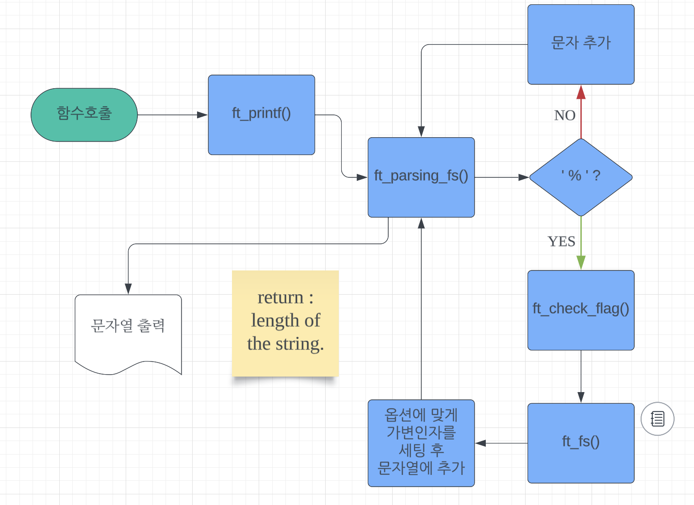

# ft_printf
42 두 번째 프로젝트 - ft_printf
직접 만드는 printf 함수.

---
## 프로젝트 소개
- 42과정  C project 내에서 사용될 printf 함수를 직접 만들어보자.
- `-std=c99` flag를 활용하여 컴파일 진행하도록 한다.
- 가변인자 함수라는 개념에 대해 활용해보자.

---

## 구현대상 
### Makefile
- `flag`: -Wall -Wextra -Werror.
- 사용 컴파일러 `cc`
- Mandatory, Bonus, clean, fclean, re 동작 구현
- 직접 만든 C 소스코드를 `libftprintf.a` 로 생성

### ft_printf()
- "cspdiuxX%" 에 대한 변환 기능 구현.
- '-', '0', '.', '#', ' ', '+' 에 대한 플래그 처리 기능(Bonus part) 구현.

---
## flowChart
